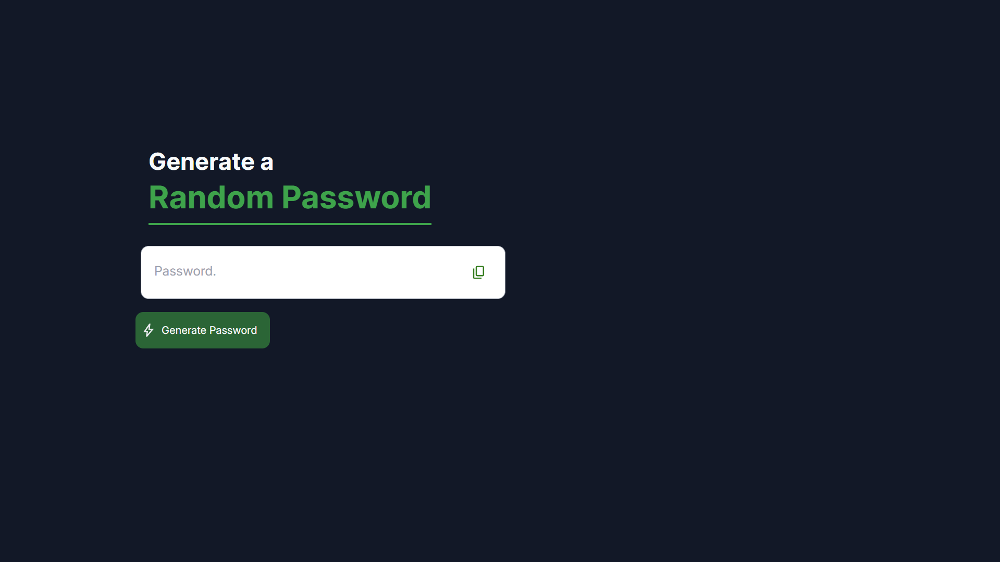

# 🔑 Random Password Generator

A sleek, modern web app to generate strong, random passwords instantly. Built with vanilla JavaScript, Tailwind CSS, and a touch of GSAP for smooth animations.



---

## 🌟 Live Preview

🔥 Experience it here → [**Live Demo**](https://random-password-generator-ggh8.vercel.app/)

> 🎥 No need to install anything — just click and start exploring!

---

## ✨ Features

- **One-click password generation**  
  Instantly create secure, random passwords with a single click.

- **Copy to clipboard**  
  Effortlessly copy your generated password with a stylish animated confirmation.

- **Responsive & modern UI**  
  Clean, mobile-friendly design using Tailwind CSS.

- **Smooth animations**  
  Subtle transitions powered by GSAP for a delightful user experience.

---

## 🚀 Getting Started

1. **Clone the repository**

   ```bash
   git clone https://github.com/your-username/random-password-generator.git
   cd random-password-generator
   ```

2. **Install dependencies**  
   _(If you want to build Tailwind from source)_

   ```bash
   npm install
   ```

3. **Run locally**  
   Open `index.html` directly in your browser, or use a local server:
   ```bash
   npx serve .
   ```

---

## 🛠️ Customization

- **Password length:**  
  Change the default length in `src/main.js` by editing the `randomPassword(length)` function.

- **Character set:**  
  Modify the `chars` array in `src/main.js` to include/exclude specific characters.

- **Styling:**  
  Tweak the look and feel in `dist/output.css` or directly in the HTML using Tailwind classes.

---

## 📸 Preview


---

## 📄 License

MIT License

---

> Made with ❤️ by Prabhjot Singh
